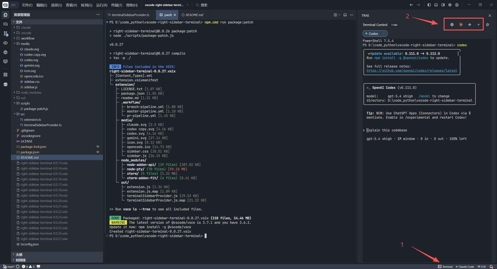

# Sidebar Terminal Hub

一个把可交互命令行直接放进 VS Code 辅助侧边栏的扩展。

Repository: [Junyu06/sidebar-terminal-hub](https://github.com/Junyu06/sidebar-terminal-hub)

终端不再需要单独占一个底部面板标签页，而是可以直接固定在侧边栏里，适合长期挂着命令行的工作流。



## 功能特性

- 在辅助侧边栏中直接显示可交互终端
- 支持多个终端会话标签
- 支持直接键盘输入、粘贴、运行命令
- 支持 ANSI / TUI 类终端输出
- 支持状态栏 `Terminal` 按钮一键打开
- 支持在视图标题栏中新建 / 关闭当前终端
- 支持自定义快捷按钮，按你的工作流启动常用命令

## 使用方式

- 点击状态栏中的 `Terminal`
- 点击 `+` 新建多个终端标签
- 点击 `×` 关闭当前终端标签
- 在设置页里添加你自己的快捷命令按钮

## 适用场景

- 把终端长期固定在右侧辅助栏
- 同时保留多个 CLI 会话
- 给仓库开发命令、测试命令或脚本做快捷入口

## 开发

```bash
npm install
npm run compile
```

然后在 VS Code 中按 `F5` 启动扩展开发宿主窗口。

## 打包

```bash
npm.cmd run package:patch
```

这个命令会自动：

- 补丁版本号 `+1`
- 编译扩展
- 生成新的 `.vsix`

## Notes

这个仓库当前作为独立维护版本使用，定位是一个更聚焦的 sidebar terminal hub。

## License

MIT
