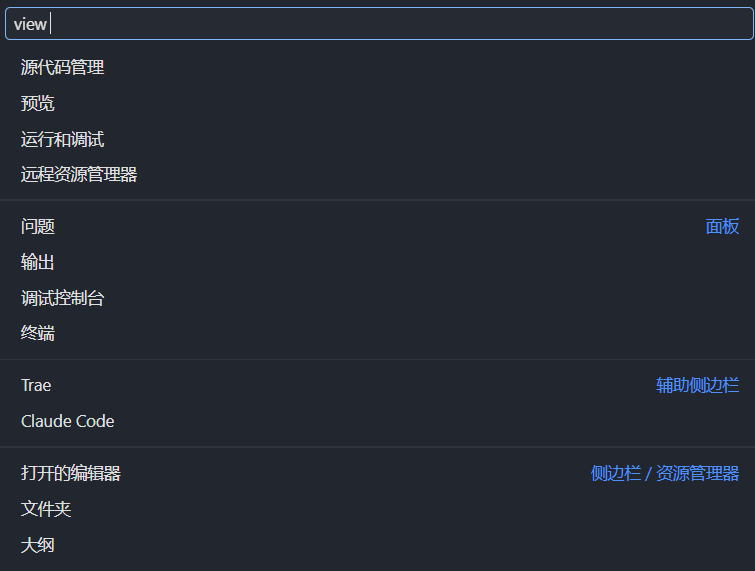

# Right Sidebar Terminal

一个轻量的 VS Code 扩展，用来把终端入口放到右侧辅助侧边栏（Auxiliary Bar / Secondary Sidebar）中，并提供更顺手的终端管理操作。



## 功能特性

- 在状态栏提供 `Terminal` 按钮，一键打开右侧终端侧栏
- 在右侧辅助侧边栏中展示终端列表与当前终端详情
- 支持创建编辑器终端（Editor Terminal）和面板终端（Panel Terminal）
- 支持拆分当前终端、聚焦当前终端、关闭当前终端
- 支持向当前终端发送命令，或仅粘贴命令不立即执行
- 支持记住默认创建位置：`editor` 或 `panel`
- 能识别扩展创建的终端与 VS Code 原生已存在终端

## 适用场景

如果你希望：

- 把终端入口放到右侧，而不是底部面板
- 快速管理多个终端
- 在侧栏里完成创建、切换、聚焦、关闭等终端操作

那么这个扩展会比较适合你。

## 安装方式

### 方式一：从 VSIX 安装

如果你已经打包出 `.vsix` 文件：

1. 在 VS Code 中打开命令面板
2. 执行 `Extensions: Install from VSIX...`
3. 选择项目根目录下对应的 `.vsix` 文件

## 使用说明

### 打开终端侧栏

- 点击状态栏中的 `Terminal` 按钮
- 或在命令面板执行 `Open Terminal Sidebar`

### 在侧栏中可执行的操作

- 新建编辑器终端
- 新建面板终端
- 拆分当前活动终端
- 聚焦当前终端
- 关闭当前终端
- 刷新终端列表
- 输入命令并发送到当前终端
- 切换默认终端创建位置

## 开发

### 环境要求

- Node.js
- npm
- VS Code `1.107.0` 或更高版本

### 本地启动

```bash
npm install
npm run compile
```

然后在 VS Code 中按 `F5` 启动扩展开发宿主窗口。

### 项目结构

```text
.
├─ media/                     # 图标等静态资源
├─ scripts/                   # 辅助脚本
├─ src/
│  ├─ extension.ts            # 扩展入口
│  └─ terminalSidebarProvider.ts
├─ out/                       # TypeScript 编译输出
├─ package.json               # 扩展清单
└─ .vscodeignore              # VSIX 打包忽略规则
```

## 主要命令

- `terminalSidebar.open`

## 打包

如果需要发布或本地分发，可以先安装 VS Code 打包工具后执行：

```bash
npx @vscode/vsce package
```

项目中已有 `.vscodeignore` 用于控制扩展打包内容。

## License

本项目基于 MIT License 开源，详见 `LICENSE`。
